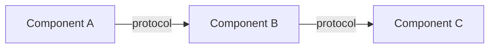

# Skill: prototype-spec

## Description

Generates the minimal but realistic project specification for a phase's hands-on exercise. Language/tool agnostic — describes components, interfaces, and observable behaviors. The learner picks the stack.

## Trigger

Invoked by Phase Instructor when transitioning from theory to hands-on building.

## Input Parameters

| Parameter | Type | Required | Description |
|-----------|------|----------|-------------|
| `phase_number` | Number | Yes | Current phase (1-12) |
| `learner_stack` | String | No | Learner's chosen language/framework (if decided) |
| `previous_artifacts` | Array | No | What was built in previous phases (for integration) |

## Output Structure

```markdown
## Prototype Specification — Phase {N}: {Title}

### What You're Building

{1-2 sentence summary of the system. Not what it DOES — what it DEMONSTRATES.}

Example: "A key-value store that makes replication lag VISIBLE — you'll see reads
return stale data and measure exactly how stale."

### Architecture

{Mermaid diagram showing components and their interactions}



### Components

#### Component 1: {Name}
- **Role:** {what it does in the system}
- **Inputs:** {what it receives and from whom}
- **Outputs:** {what it produces and for whom}
- **Key constraint:** {the thing that makes this non-trivial}

#### Component 2: {Name}
- ...

### Interface Contracts

```
{Component A} → {Component B}:
  Request: {shape of data sent}
  Response: {shape of data returned}
  Failure mode: {what happens when B is unavailable}
```

### Observable Behaviors (Success Criteria)

These are how you know your prototype WORKS. Not code correctness — system behavior.

1. ✅ {Observable behavior 1}
   "You know this works when you can see: {specific measurable thing}"
   
2. ✅ {Observable behavior 2}
   "You know this works when you can see: {specific measurable thing}"

3. ✅ {Observable behavior 3}
   "You know this works when you can see: {specific measurable thing}"

### Explicit NON-Goals

Do NOT build these. They waste time or hide the concept:

- ❌ {Thing that seems natural but distracts}
- ❌ {Thing that over-engineers the solution}
- ❌ {Thing that belongs to a future phase}

### Constraints That Force the Real Problem

These constraints exist to prevent you from accidentally avoiding the hard part:

- ⚠️ {Constraint 1: e.g., "You MUST handle concurrent access from 2+ clients"}
- ⚠️ {Constraint 2: e.g., "You MUST be able to kill one component without killing all"}
- ⚠️ {Constraint 3: e.g., "You MUST serve reads while writes are in progress"}

### Stack Suggestions (Optional — Your Choice)

If you don't have a preference, here are options ranked by learning clarity:

| Stack | Why It's Good for Learning This | Watch Out For |
|-------|--------------------------------------|---------------|
| {Option 1} | {reason} | {gotcha} |
| {Option 2} | {reason} | {gotcha} |

### Connection to Previous Phase

Your Phase {N-1} artifact ({description}) becomes {role in this phase}.
{How to integrate or extend it — or when to start fresh.}
```

## Specification Principles

1. **Minimal but not toy.** The prototype should be small enough to build in 2-4 hours but complex enough that real failure modes emerge.

2. **Observable by default.** Every component should emit signals (logs, metrics, timestamps) that make behavior visible without a debugger.

3. **Breakable by design.** Architecture must allow independent failure of components. Monolithic prototypes defeat the purpose.

4. **Stack-agnostic unless learner chooses.** Describe in terms of "a process that accepts TCP connections" not "a Node.js Express server."

5. **Constraints are the curriculum.** The constraints section is where learning happens. Without constraints, learners build the easy version that doesn't expose the concept.

## Phase-Specific Prototype Summaries

| Phase | Prototype Core | Key Constraint |
|-------|---------------|----------------|
| 1 | HTTP service + file-backed store | Must handle concurrent connections on a SINGLE machine |
| 2 | Multiple service instances + request router | State must be fully external; instances must be interchangeable |
| 3 | File-backed key-value store with WAL | Must not lose acknowledged writes on crash |
| 4 | Phase 3 store + caching layer | Must serve reads during cache invalidation without stampede |
| 5 | Producer → Queue → Consumer pipeline | Must handle consumer crash without losing messages |
| 6 | Primary + replica data store | Must serve reads from replica; must show lag |
| 7 | Data store sharded across 3+ nodes | Must route correctly; must handle one shard going down |
| 8 | 3-node leader election + distributed lock | Must prevent split-brain; must detect and recover |
| 9 | 3-service saga (order → inventory → payment) | Must handle partial failure with compensation |
| 10 | Phase 9 system + observability stack | Must diagnose a latency spike using only telemetry |
| 11 | Phase 9 system + resilience patterns | Must degrade gracefully; must not cascade |
| 12 | Full system under 10x load estimation | Must identify ceiling and propose migration path |
