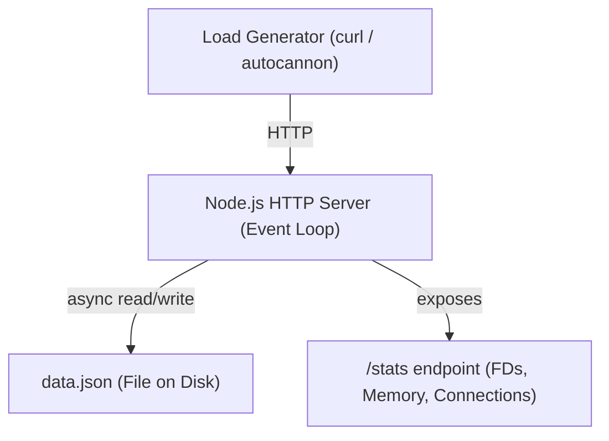

# Prototype Specification — Phase 1: The Single Machine Ceiling

## What You're Building

An HTTP key-value store that makes **resource exhaustion VISIBLE** — you'll watch file descriptors climb, see the exact moment the ceiling hits, and observe how the system degrades.

## Architecture



## Components

### 1. HTTP Server (Event Loop)
- **Role:** Accept connections, route requests, serve responses
- **Tech:** Node.js `http` module (no Express — keep it raw to see the mechanics)
- **Key constraint:** Single-threaded event loop. File I/O via `fs.promises` (uses libuv thread pool)

### 2. File-Backed Store
- **Role:** Persist key-value pairs as JSON on disk
- **File:** `data.json` — read entire file, modify in memory, write entire file
- **Key constraint:** No database — raw file I/O so you can observe disk IOPS and file locking behavior

### 3. Resource Monitor
- **Role:** Expose current resource consumption at `/stats`
- **Metrics to expose:**
  - Open file descriptors (count from `/proc/self/fd` or `process._getActiveHandles()`)
  - Memory usage (`process.memoryUsage()`)
  - Active connections (track via `server.getConnections()`)
  - Event loop lag (measure time between `setTimeout(fn, 0)` scheduling and execution)

## Interface Contracts

```
Client → Server:
  PUT /data/:key    Body: { "value": "..." }  → 200 { "key": "...", "value": "..." }
  GET /data/:key    → 200 { "key": "...", "value": "..." } | 404
  GET /stats        → 200 { "fds": N, "memory_mb": N, "connections": N, "event_loop_lag_ms": N }
  
  Failure mode: When FDs exhausted → EMFILE error → 503 Service Unavailable
  Failure mode: When disk full → ENOSPC error → 507 Insufficient Storage
```

## Observable Behaviors (Success Criteria)

1. ✅ **Basic CRUD works**
   "You know this works when: `PUT /data/hello` with `{"value":"world"}` followed by `GET /data/hello` returns `{"key":"hello","value":"world"}`"

2. ✅ **Resource monitoring is live**
   "You know this works when: hitting `/stats` shows FD count increase as you open more connections, and decrease when they close"

3. ✅ **You can SEE the ceiling approaching**
   "You know this works when: under load, `/stats` shows FDs climbing from ~20 toward 1024, and you can predict when it'll fail"

4. ✅ **Graceful error on exhaustion**
   "You know this works when: after FD exhaustion, new requests get 503 (not a crash), and the server recovers when connections close"

## Explicit NON-Goals

- **No authentication** — irrelevant to resource limits
- **No Express/Fastify** — they hide the event loop mechanics
- **No database** — hides disk I/O characteristics
- **No clustering** — this is Phase 1 (single machine)
- **No fancy error handling** — let it break visibly

## Constraints (Intentionally Limiting)

| Constraint | Why |
|---|---|
| Single JSON file for all data | Forces sequential writes, makes disk contention visible |
| No connection pooling | Makes FD consumption linear and predictable |
| Default `ulimit -n 1024` | Low ceiling = faster to hit during testing |
| No request timeouts initially | Lets slow connections pile up (we'll fix this in failure lab) |

## What You'll Break (Preview)

After building, we'll run these failure scenarios:
1. **FD exhaustion** — open 1000+ connections, watch new ones get EMFILE
2. **Disk full** — fill the partition, observe write failures
3. **Event loop blocking** — add a synchronous CPU task, measure lag spike
4. **Memory pressure** — grow the data store until OOM killer strikes

## Stack

- **Runtime:** Node.js (event loop model)
- **HTTP:** Built-in `http` module
- **Storage:** `fs.promises` → `data.json`
- **No dependencies** (zero npm packages)
